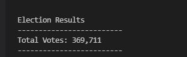
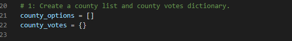
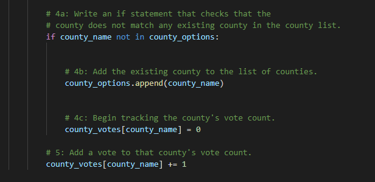
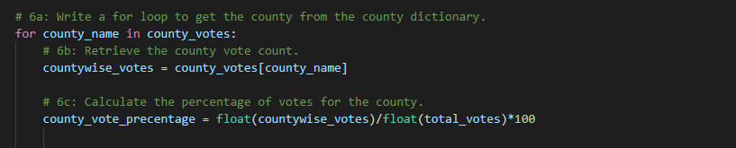
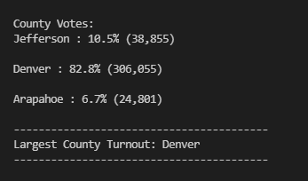
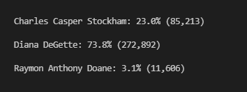
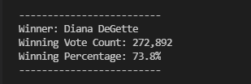
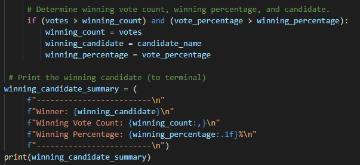

# Election_Analysis

## Overview of Election Audit
In this project I'm assisting Colorado board of election employee, Tom, by developing a script to automate and audit the analysis of the election data currently on tabulated format. 

My task is to report total number of votes cast, total number of votes for each candidate, the percentage of the vote for each candidate, and determine the winner of the election based on data set provided.

This task is usually done on Excel but Tom's manager wants to automate the process using Python congressional district but also senatorial districts and local elections.

If the automation success using Python, the same automation will be applied to audit other not only congressional district but also senatorial districts and local elections.

Mainly, the project contains 2 parts:
1) Candidate wise vote cast analysis
   In this part, python script calculates:
   - Total number of votes cast
   - list of candidates 
   - Total number of votes for each candidate 
   - Percentage of votes for each candidate 
   - The winner of election based on popular vote 
   
2) County wise vote cast Analysis
  Python script will give output:
   - Total number of votes cast on each county 
   - Percentage of votes cast on each county
   - Highest county Turnout

## Election-Audit Results
- How many votes were cast in this congressional election?
  
  Total votes cast in this election is 396,711
  
  
  
 - Breakdown of the number of votes and the percentage of total votes for each county in the precinct.
   - To calculate countywise votes:
     First I created county_options list and county_votes dictionary.
     
     
     
    - then condition statement check that the county does not match any existing county in the county list and then add the existing county to county list  of counties and add vote to the county's vote count
     
    
     
     
     - At last, calculate votes and presentage for each county using for loop
     
     
     
  - Which county had the largest number of votes?
    - According to the analysis, Denver county has largest number of votes
    - Below is the output for countywise analysis
    
       
       
   - Breakdown of the number of votes and the percentage of the total votes each candidate received.
     
     
    
    
   - Which candidate won the election, what was their vote count, and what was their percentage of the total votes?
      
      - Candidate Diana DeGette won the election.
      
         
        
       - Following part of code will describe how does the script calculate/retreive winning precentage and candidate
       
         
         
 ## Election-Audit Summary
 
 With minor changes to this code, we can use same script to senatorial election.In this code we are calculating each candidates voting count and percentage after calculating this we can chose predefined number of candidates with highest votes
     
 i.e for new jersey county we are selecting 2 senators ,instead select one winner we can select 2 by changing the code.
 
 local elections like school board, city council election we can easily use same code with fewer adjustments school board members elected by residents of the school district. Most school boards contain 5-15 board members elected by voters. Using the same code, we can calculate each candidates votes and percentage.

